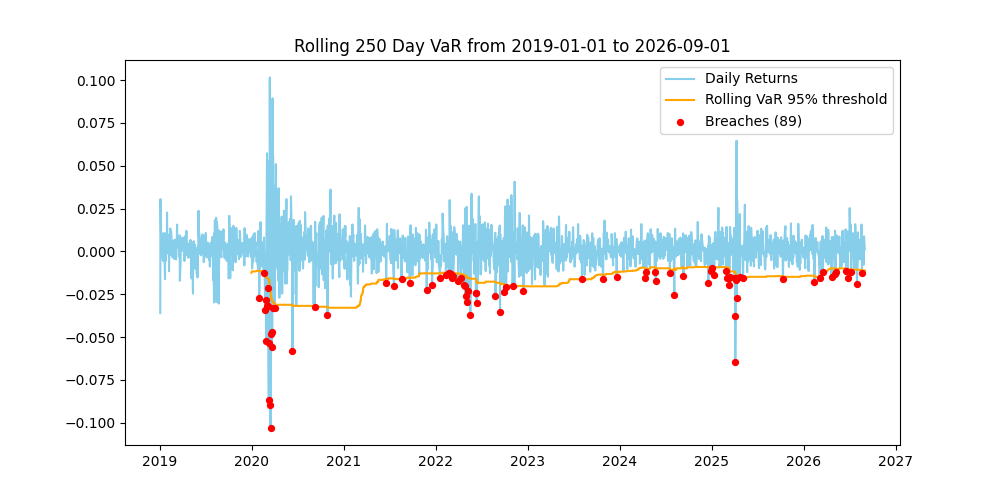

This README is specifically for VAR_Portfolio_Analysis

## Overview:
The purpose of this code was to walk through an exercise creating a portfolio, generating statistics, and displaying the final results. This code estimates 1-day VaR and CVaR for a $1M, multi-asset portfolio using historical, parametric, and Monte Carlo methods, then backtests a rolling VaR with a Kupiec POF test. Claude was used to frame the exercise but all code was written by me. The script walks through:

1. Data gathering (yfinance, adjusted prices, 2019-01-01 to 2026-09-01)
2. Portfolio statistics: annualized return, Sharpe ratio, max drawdown, annualized standard deviation
3. Three versions of VaR (95% and 99%) and CVaR
4. A rolling 250-day VaR backtest with a Kupiec POF test, which checks whether the observed breach rate is statistically consistent with the rate the VaR implies
5. Visualizations of portfolio performance and where the breaches occurred

## Results:
While this code can take any combination of ticker symbols and weights, the sample was done with 5 stocks (AAPL, JPM, XOM, JNJ, PG) with corresponding weights of .25, .2, .15, .2, and .2. The results of the 3 VaR calculations were as follows:

| Method      | VaR 95% | VaR 99% |
|-------------|---------|---------|
| Historical  | 1.5642% | 3.1833% |
| Parametric  | 1.8220% | 2.6055% |
| Monte Carlo | 1.8024% | 2.5650% |

CVaR (historical): 2.6974% at 95%, 5.0318% at 99%
Kupiec POF Test: P-value of 0.56



- Historical VaR is lower than normal-based VaR at 95% but higher at 99%, indicating that there may be fat tails in this distribution. 
- The backtest had 89 breaches vs. an expected 84 based on 95% VaR, so the backtest results were generally in line with expectations. 
- The Monte Carlo run generated 10,000 returns against portfolio statistics, leveraging asset-level mean returns and covariance matrix, then applies the weights to create random number draws with the appropriate mean and standard deviation.
- Average tail losses are also larger relative to VaR than a normal distribution would give: CVaR is about 1.7x VaR at 95% and 1.6x at 99%, versus roughly 1.25x and 1.15x for a normal.
- The 99% CVaR is also based on only 20 observations so that may be resulting in some noise in the calculation
- The Kupiec POF test p-value is .56 so the model isn't rejected


## Assumptions:
- The returns are assumed to be normally distributed which understates the amount of tail risk
- Weights are fixed, in a real portfolio these may be rebalanced over time
- This uses Yahoo adjusted prices and historical correlations which may not hold in future scenarios
- The Kupiec test checks breach frequency, not whether breaches cluster.

## How to run

```bash
pip install -r requirements.txt
python portfolio_var.py
```

An internet connection is required to download prices. Charts are saved to the `VAR_output/` folder.